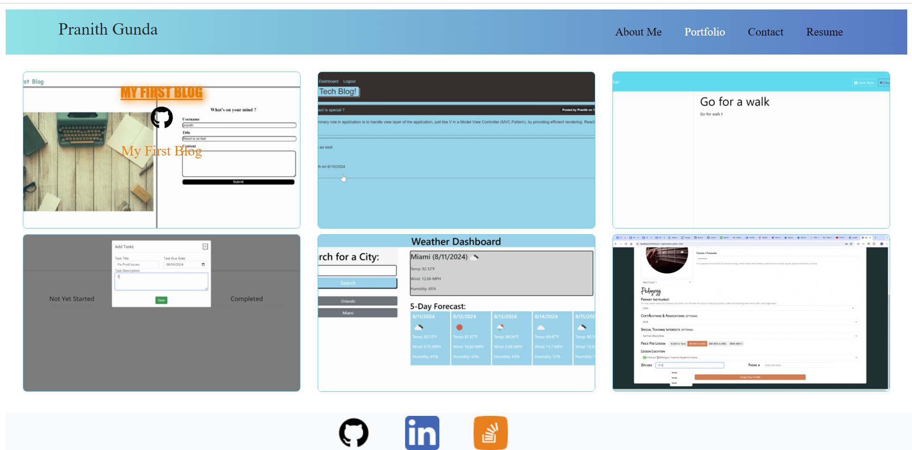

# My-Portfolio

## Description

My-Portfolio describes my professional background, experience and skills that, I have acquired through out my journey as a software developer. Please review the applications listed on the Portfolio tab, that showcases my skills and get in touch through the contact form available on my portfolio for futher questions. As a fullstack developer, I am open for new oppurtunities, please review the resume section to know more about me.

My-Portfolio is built using the React Javascript library. Each portfolio section is a React component and built using React Bootstrap framework for styling. The application leverages, react features such as state, to apply hover effect on cards to display additional information and also for validations on contact fields.

## Screenshots

## Link To Deployed App

https://pranithgunda-portfolio.netlify.app/

